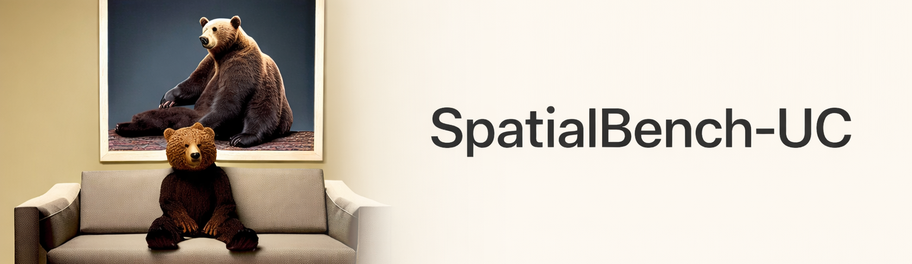

<br/>
# SpatialBench-UC

**SpatialBench-UC** is a benchmark and evaluation toolkit for **pairwise spatial relations** in text-to-image generation, with explicit **abstention and uncertainty modeling**.

Spatial verification via object detection + geometry is often ambiguous (missing detections, multiple plausible boxes, near-boundary geometry). SpatialBench-UC outputs **PASS / FAIL / UNDECIDABLE** with a **confidence score**, enabling **risk-coverage analysis** instead of a single scalar score.

## Repository contents

| Component | Description | Path |
|-----------|-------------|------|
| **Prompt suite** | 200 prompts (50 object pairs x 4 relations), 100 counterfactual pairs | `data/prompts/v1.0.1/` |
| **Checker** | Detector-based verification with abstention and confidence | `src/spatialbench_uc/evaluate.py` |
| **Reporting** | Tables and plots from per-sample outputs | `src/spatialbench_uc/report.py` |
| **Audit utilities** | Risk-coverage analysis on human-labeled subset | `src/spatialbench_uc/audit/` |
| **Frozen run bundle** | Paper results (no image regeneration needed) | `runs/final_20260112_084335/` |

## Installation

### Linux with CUDA 12.1 (recommended for paper reproduction)

```bash
python -m venv .venv
source .venv/bin/activate
pip install -r requirements/torch-cuda121.txt
pip install --require-hashes -r requirements/lock/requirements-linux-cuda121.txt
pip install -e .
```

### Other platforms

```bash
# macOS (Apple Silicon)
pip install -r requirements/torch-mps.txt && pip install -e .

# Linux CUDA 11.8
pip install -r requirements/torch-cuda118.txt && pip install -e .

# CPU only
pip install -r requirements/torch-cpu.txt && pip install -e .
```

## Reproducing paper results

The frozen run bundle contains all per-sample outputs needed to reproduce paper tables **without regenerating images**.

```
runs/final_20260112_084335/
├── sd15_promptonly/eval/per_sample.jsonl   # Checker outputs (calibrated)
├── sd15_boxdiff/eval/per_sample.jsonl
├── sd14_gligen/eval/per_sample.jsonl
├── reports/v1_calibrated_*/tables/*.csv    # CSV tables
└── audits/v1/                              # Human audit labels + analysis
```

### Regenerate report from existing outputs

```bash
python -m spatialbench_uc.report \
  --config configs/report_v1.yaml \
  --eval-subdir eval
```

### Recompute audit metrics (no GPU required)

```bash
python scripts/recompute_audit_metrics_from_eval_jsonl.py \
  --sample runs/final_20260112_084335/audits/v1/sample.csv \
  --labels runs/final_20260112_084335/audits/v1/labels_filled.json \
  --out runs/final_20260112_084335/audits/v1/analysis_calibrated \
  --eval-subdir eval \
  --tau-sweep unique
```

## Running the checker on new images

### 1. Generate images

```bash
python -m spatialbench_uc.generate \
  --config configs/gen_sd15_promptonly.yaml \
  --prompts data/prompts/v1.0.1/prompts.jsonl \
  --out runs/my_run
```

### 2. Evaluate with the checker

```bash
python -m spatialbench_uc.evaluate \
  --manifest runs/my_run/manifest.jsonl \
  --config configs/checker_v1.yaml \
  --out runs/my_run/eval
```

### 3. Generate report

```bash
python -m spatialbench_uc.report \
  --runs runs/my_run \
  --out runs/my_run/reports/v1
```

## Key terminology

- **PASS/FAIL/UNDECIDABLE** are **checker outputs**, not ground-truth accuracy.
- **Coverage** = fraction of samples where the checker makes a decision (PASS or FAIL).
- **Risk** (audited subset) = 1 - accuracy on samples decided by both checker and human.

## Citation

If you use this benchmark, please cite:

```bibtex
@misc{rostane2026spatialbenchucuncertaintyawareevaluationspatial,
      title={SpatialBench-UC: Uncertainty-Aware Evaluation of Spatial Prompt Following in Text-to-Image Generation}, 
      author={Amine Rostane},
      year={2026},
      eprint={2601.13462},
      archivePrefix={arXiv},
      primaryClass={cs.AI},
      url={https://arxiv.org/abs/2601.13462}, 
}
```

**arXiv:** [https://arxiv.org/abs/2601.13462](https://arxiv.org/abs/2601.13462)

## License

This work is licensed under [CC BY 4.0](https://creativecommons.org/licenses/by/4.0/).
